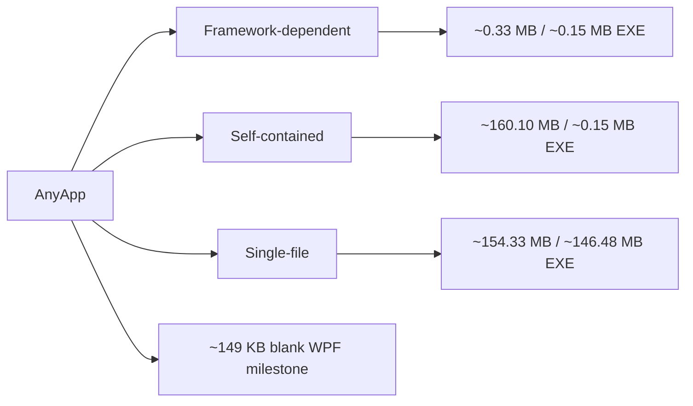

# AnyApp

AnyApp is the desktop proof of the composition architecture.

It is the Windows desktop counterpart to the browser-facing WebPage/WebForge host: the desktop of the Workshop, not another application-specific framework.

## Startup is now manifest-driven

AnyApp is the host. It does not choose an Experience by embedding the Experience definition in the host.

Normal startup now follows the Workshop entry sequence:

~~~text
AnyApp
  |
  | no explicit launch manifest
  v
Workshop-authored splash sequence
  |
  | currently one authored image: the Workshop avatar
  v
last successfully run Experience manifest
  |
  | if none exists or it can no longer compose
  v
Forge Experience manifest
  |
  v
FSM_COS
  |
  v
RuntimeAssembly
  |
  v
host manifestation
~~~

The splash is host-owned presentation around composition; **FSM_COS remains the composition boundary**. The initial splash sequence contains one Workshop-authored image and is intentionally structured so additional authored splash Experiences can be added later without changing the composition kernel.

The Forge is the user's entry Experience when there is no usable last-run Experience. It is not a special launcher screen. Its semantic surface contains a diegetic EXPLORE EXPERIENCES portal; entering that portal opens the Experience repository flow.

The Forge manifest lives beside the other source manifests:

~~~text
experiences/
├── forge/
│   └── 1.0.0/
│       └── manifest.json
└── moniker/
    └── 1.0.0/
        └── manifest.json
~~~

A successfully entered non-Forge Experience is persisted as the next startup candidate outside the application binary. Forge itself is not persisted as the last-run Experience, so it remains the fallback entry point.

For local development, an explicit manifest can still be supplied:

~~~powershell
dotnet run --project AnyApp.csproj -- --experience-file=experiences/moniker/1.0.0/manifest.json
~~~

The repository endpoint used by the Forge's Experience exploration portal can be overridden:

~~~powershell
dotnet run --project AnyApp.csproj -- --repository-endpoint=http://localhost:5000/
~~~

## Composition boundary

Once a manifest has been selected, the runtime path remains:

~~~text
RuntimeManifest
      |
      v
   FSM_COS
      |
      v
RuntimeAssembly
      |
      v
MonikerMicroBundle
      |
      v
semantic GuiNode
      |
      v
GUI.WPF
      |
      v
native WPF
~~~

The MicroBundle remains static and previewable. MonikerExperience.ExecutePresentation(...) adds the wave behavior only when the selected Experience executes.

## Semantic intent exchange

AnyApp is the first higher-level host demonstrating the three-layer semantic exchange without coupling the foundation packages together:

~~~text
ProtocolAI
   WHAT
    |
    v
GrammarAI
    HOW
    |
    v
FSM_UserIO
SemanticIntent
    |
    v
AnyApp / Experience host
~~~ 

The host owns its Experience vocabulary in `WorkshopSemanticExchange`. ProtocolAI supplies deterministic protocol/symbol identity, GrammarAI describes which identities are structurally admitted, and FSM_UserIO carries the application intent.

For example, the Forge Experience manifest carries:

~~~json
"intent": {
  "name": "open.forge",
  "protocolId": 4200
}
~~~

AnyApp resolves that intent through ProtocolAI, verifies that its protocol symbol is admitted by the GrammarAI definition, and only then proceeds to composition.

This is deliberately a **host integration**, not a new dependency chain between the foundation packages:

~~~text
FSM_UserIO  ---> carries semantic intent
ProtocolAI  ---> owns vocabulary identity
GrammarAI   ---> owns structural relationships
AnyApp      ---> owns Experience meaning and execution
FSM_COS     ---> composes the runtime
~~~

The integration is documented more deeply in ProtocolAI's [Ecosystem Integration](https://github.com/TrentBest/TheSingularityWorkshop.ProtocolAi/blob/master/docs/ECOSYSTEM_INTEGRATION.md).

## Physical baseline

AnyApp is currently a **functional-ish desktop proving ground**, not a finished application. That makes its current physical measurements useful as a baseline, but not as a promise of final product size.

The current local baseline is approximately:

| Publish form | Directory | EXE |
|---|---:|---:|
| Framework-dependent | 0.33 MB | 0.15 MB |
| Self-contained | 160.10 MB | 0.15 MB |
| Single-file self-contained | 154.33 MB | 146.48 MB |
| Blank WPF Release milestone | — | ~149 KB |

The deployment-mode distinction matters: self-contained and single-file deployments carry the .NET runtime, while the small application executable is a different measurement.

There is **no separate production CLI artifact yet**, so a CLI footprint is intentionally not advertised.

The reproducible CI measurement path lives in [baseline.yml](.github/workflows/baseline.yml), and the surrounding architecture/energy discussion lives in FSM_COS's [Performance, Footprint, and Efficiency](https://github.com/TrentBest/TheSingularityWorkshop.FSM_COS/blob/architecture/domain-owned-microbundle-contract/docs/PERFORMANCE_AND_EFFICIENCY.md).

## Architectural intent

AnyApp should remain the host.

It should not absorb:

- FSM_COS composition semantics;
- GUI.Core semantic definitions;
- GUI.WPF renderer internals;
- MicroBundle repository semantics;
- Workshop Experience logic.

The repository is responsible for discovering and delivering published Experience artifacts. AnyApp is responsible for selecting one and handing its manifest to FSM_COS.

## Development

AnyApp is currently a direct `.csproj` host; the repository does not require a solution file.

~~~powershell
dotnet restore AnyApp.csproj
dotnet build AnyApp.csproj --configuration Release
dotnet test tests/TheSingularityWorkshop.AnyApp.Tests/TheSingularityWorkshop.AnyApp.Tests.csproj --configuration Release
~~~

The CI workflow uses a Windows runner because WPF is Windows-specific.
